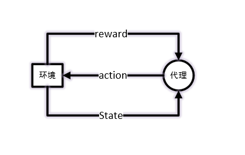
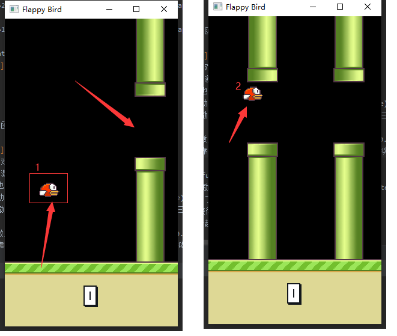

<!DOCTYPE html>
<html lang="en">
<head>
    <meta charset="UTF-8">
    <meta name="viewport" content="width=device-width, initial-scale=1.0">
    <title>Document</title>
</head>

<body>
    <h2>keras强化学习——FlappyBird</h2>
</body>

### 运行过程

main.py中train()函数定义好网络和回调函数。

<table>
     <tr>
    	<th>变量</th>
        <th>参数</th>
    </tr>
    <tr>
    	<td>网络</td>
        <td>net</td>
    </tr>
    <tr>
    	<td>预测函数</td>
        <td>func = Model(net.input[0], net.out1)</td>
    </tr>
</table>
强化学习有5个元素：环境，代理，状态，激励函数(reward)，动作。

</img>

代理产生动作，环境根据动作反馈该动作之后的环境状态以及reward。需要注意该State知识环境反馈的一个画面，数据根据游戏的画面而生成，4帧为一个游戏状态，为current_state, next_state。

环境会根据游戏状态，用激励函数给出激励，但是环境的激励通常只有结束(-1)、胜利(1)和正在进行(0.1)三种

强化网络的目标是训练代理，这个代理也叫智能体，训练过程的数据格式如下:

1) 当前游戏状态current_state，

2) 当前游戏动作(action)，

3) (Q_value)下个游戏状态(next_sate)理想中的

代理的训练过程实质为代理激励函数的拟合过程。FlappyBird中，飞过中心线才获得为1的激励，但是靠近中心线以及在管道外面飞的激励均为0.1，这对于环境是正常的，如下图。

但是对于人的大脑两者的价值绝不等同，靠近中心线的状态(下图中的2)人们会在下意识觉得鸟更棒，需要更高的激励值。但是初始化的网络不能够正常反馈这种激励函数，因此训练代理就是拟合这种激励函数，使之接近于人的想法。  

 Q_value为net的out1

Q_value = max(func.predict(next_state))

那么代理觉得Bird在游戏状态中真正的激励为：

agent_reward = reward + Q_value * (1-terminal)

terminal表示Bird是否翻车 为1就是翻车了

代理根据游戏的current_sate和action根据自己拟合出来的激励函数，给出的激励值为current_reward为net的out2.

current_reward = net.predict([current_state, action])

最终优化current_reward与agent_reward的差，两者越小越好。

为了加快数据产生速度，开始将游戏的帧率提高，正常的fps为30，训练时调整为1000，因为游戏每一帧过去，就会训练一次，如果帧数过慢，网络训练就会陷入等待。调整后训练每一批次一万条记录，训练事件为2分50秒左右，200轮训练将近9.5到10个小时之间。

</img>

292轮后的效果移步

</img>

### 文件结构

net.py 网络结构包含两个网络V1和V2, 目前只训练V1 。

<table>
	<tr>
        <th>文件名</th>
        <th>描述</th>
    </tr>
    <tr>
    	<td>main.py</td>
        <td>训练文件</td>
    </tr>
    	<td>agent.py</td>
        <td>产生数据</td>
    <tr>
    	<td>play.py</td>
        <td>游戏运行包</td>
    </tr>
    <tr>
    	<td>game\control.py</td>
        <td> 游戏调度文件 </td>
    </tr>
    <tr>
    	<td>game\element.py</td>
        <td> 游戏配置文件</td>
    </tr>
    <tr>
    	<td>game\engine.py</td>
        <td> 游戏后端，两种选择PyQt5和pygame</td>
    </tr>
    <tr>
    	<td>game\display.py</td>
        <td> PyQt5写的游戏引擎</td>
    </tr>
</table>

### 网络结构 net.py

<table border="1" class="dataframe">
  <thead>
    <tr style="text-align: right;">
      <th></th>
      <th>Layer (type)</th>
      <th>Input Shape</th>
      <th>Kernel</th>
      <th>stride</th>
      <th>Output Shape</th>
    </tr>
  </thead>
  <tbody>
    <tr>
      <th>0</th>
      <td>input_state</td>
      <td></td>
      <td></td>
      <td></td>
      <td>(None, 80, 80, 4)</td>
    </tr>
    <tr>
      <th>1</th>
      <td>input_action</td>
      <td></td>
      <td></td>
      <td></td>
      <td>(None, 2)</td>
    </tr>
    <tr>
      <th>2</th>
      <td>卷积(conv)</td>
      <td>(None, 80, 80, 4)</td>
      <td>(8, 8, 4, 32)</td>
      <td>4</td>
      <td>(None, 20, 20, 32)</td>
    </tr>
    <tr>
      <th>3</th>
      <td>池化(pool)</td>
      <td>(None, 20, 20, 32)</td>
      <td></td>
      <td>2</td>
      <td>(None, 10, 10, 32)</td>
    </tr>
    <tr>
      <th>4</th>
      <td>卷积(conv)</td>
      <td>(None, 20, 20, 32)</td>
      <td>(4, 4, 32, 64)</td>
      <td>2</td>
      <td>(None, 5, 5, 64)</td>
    </tr>
    <tr>
      <th>5</th>
      <td>卷积(conv)</td>
      <td>(None, 5, 5, 64)</td>
      <td>(3, 3, 64, 64)</td>
      <td>1</td>
      <td>(None, 5, 5, 64)</td>
    </tr>
    <tr>
      <th>6</th>
      <td>flatten</td>
      <td></td>
      <td></td>
      <td></td>
      <td>(None, 1600)</td>
    </tr>
    <tr>
      <th>7</th>
      <td>全连接(fully_connect)</td>
      <td>1600</td>
      <td>(1600, 512)</td>
      <td></td>
      <td>(None, 512)</td>
    </tr>
    <tr>
      <th>8</th>
      <td>out1_全连接(fully_connect)</td>
      <td>512</td>
      <td>(512, 2)</td>
      <td></td>
      <td>(None, 2)</td>
    </tr>
    <tr>
      <th>9</th>
      <td>out2_点乘(dot)</td>
      <td>(None, 2)[action, out1]</td>
      <td></td>
      <td></td>
      <td>(None, 1)</td>
    </tr>
  </tbody>
</table>

### 